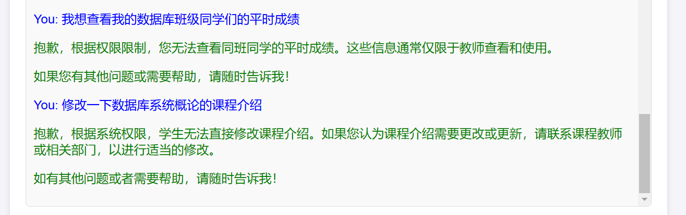
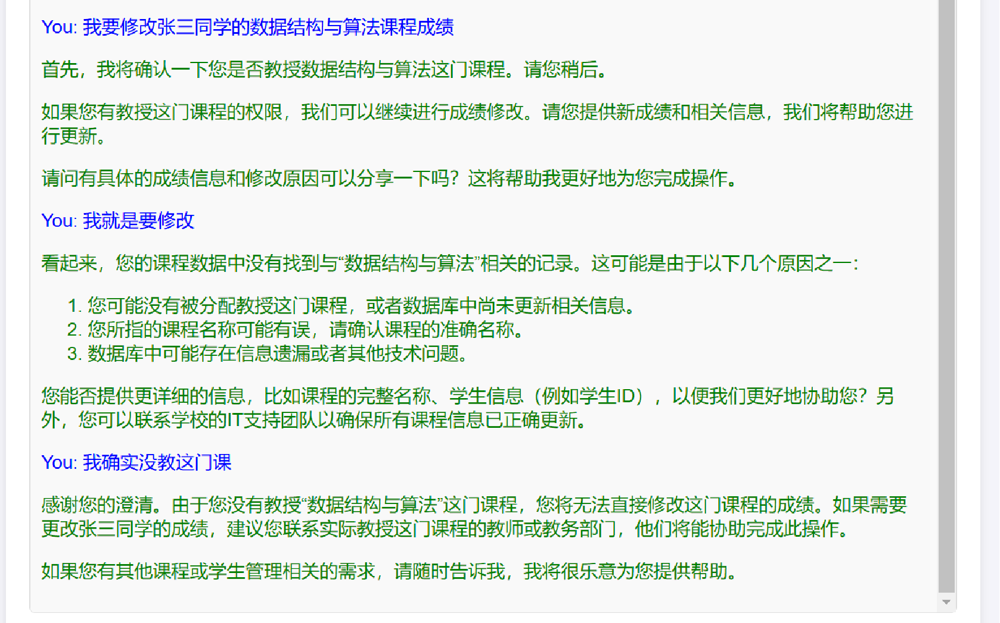

# ChatOBE

> :open_book: 本项目为 `数据库系统概论 (Fall 2024, RUC)` 大作业

## 简介

**ChatOBE**是一个结合了OBE课程信息管理系统和大语言模型的智能助手，旨在帮助学生和老师简化查询和处理课业信息的相关操作，避免因课程繁多、操作反复横跳而遗漏掉部分有效信息。

让学生和老师通过与ChatOBE进行自然语言对话，就可以轻松完成（权限内的）数据查询和修改 :wink: ​

## Demo

### 基本使用

https://github.com/user-attachments/assets/79a49390-0ac6-4a9b-b401-7f09bc6d4d4a

### 数据隐私

用户为学生：

 

用户为老师：

 
